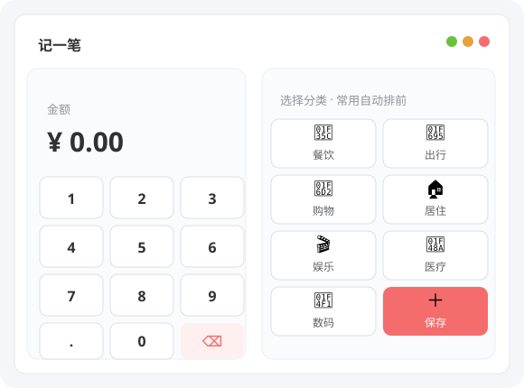
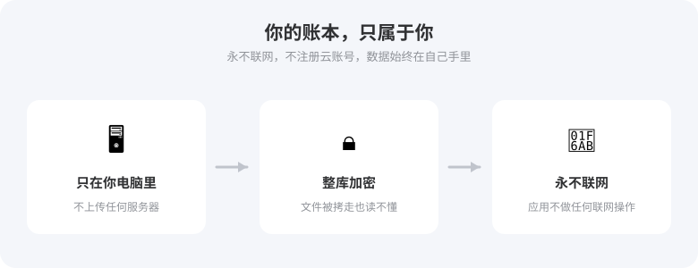

# 拾财：一个把记账做简单的 Windows 小软件

> 免费 · 开源 · 数据只存在你自己的电脑里

## 记账这件事，你坚持了多久？

很多人不是不想记账，是被工具劝退的。打开记账 App：先注册账号，再授权一堆权限，首页全是理财推荐，记一笔要翻三层菜单，输完金额还得在一堆分类里找半天——记一笔比花钱还累。好不容易坚持一个月，回头想看钱花哪了，除了流水账，什么都分析不出来。

拾财（PennyPick）就是为"想认真记账、但不想折腾"的人做的。一个 Windows 小软件，单文件，双击就能用。

## 两秒记完一笔，像按计算器一样简单

记账最怕麻烦，麻烦就不想记。拾财把"记一笔"压缩到了几秒钟：

- 打开就是记账页，大数字键盘直接按，金额输完选个分类就完事
- 常用分类自动排在前面，支出、收入一键切换
- 勾上"保存后继续记"，一笔接一笔，不打断节奏
- 微信、支付宝导出的账单，直接导入自动归类，以前没记的账不用手动补

## 记账之外，它还像个贴身小管家

- **预算预警**：给每月设一个总预算，也可以单独给"餐饮""购物"这些分类设额度。花到 80% 提醒你一次，超了再提醒一次。想控制开销、认真存钱，这是最直接的办法。
- **还款管理**：信用卡、花呗这类"先用后还"的账户，设好还款日，拾财按月帮你算好该还多少，逾期了还会标红提醒，从此告别违约金和利息。
- **收支报告**：每月、每年自动生成一份收支报告，结余、日均、分类占比、趋势变化都有，还能一键导出 PDF，年底做总结也不愁没数据。
- **固定账单**：房租、房贷、话费这类每月固定支出，建一次模板，每个月一键记入，再也不用重复录入。
- **统计图表**：钱到底花哪了？按分类、按账户、按天按月，几张图讲得明明白白。

## 你的账本，只存在你自己电脑里

这是拾财和大多数记账软件最大的不同：

- **永不联网**：数据只在这台电脑上，应用不会进行任何联网操作，也不注册任何云账号
- **整库加密**：所有数据加密保存，就算文件被人拷走，也读不出里面的内容
- **随时带走**：想备份就导出，Excel 能直接打开；换电脑也能把数据带过去

赚了多少、花在哪、存了多少，这是最私密的个人信息。把它们交到别人服务器上，你真的放心吗？

## 免费，而且开源

拾财完全免费——没有广告，没有内购，没有会员，所有功能不设任何门槛。

代码也是开源的。懂技术的朋友可以随时翻看它到底存了什么、做了什么。比起闭源软件，多一层看得见的放心。

如果你用着顺手，愿意请开发者喝杯咖啡，我会很高兴：

## 适合谁用

- 想记账，但一直找不到"不麻烦"的工具的人
- 在意隐私，不想把账本放在云上的人
- 用信用卡、花呗，总担心忘记还款的人
- 想靠预算控制消费、认真存钱的人

## 怎么开始

1. 从开源仓库的发布页（Releases）下载最新版客户端（Windows 10 / 11，约 23MB，无需安装）
2. 双击运行，设置一个主密码（以后自动解锁，不用每次输入）
3. 建好你的账号，从第一笔开始记

账是一笔一笔记出来的，好习惯也是。今天就记第一笔吧。
